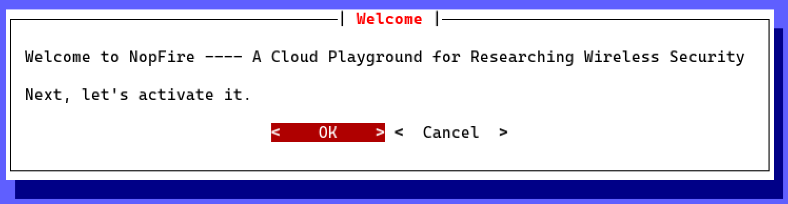
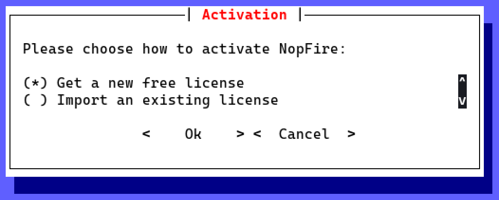

<h1 align="center">NopFire</h1>

<h3 align="center">A Cloud Playground for Researching Wireless Security</h3>

<p align="center">
    
</p>

<p align="center">
    
</p>

Nopfire is a free software, and you are welcome to redistribute it.

For non-opensource and advanced features, please get in touch with colabar@protonmail.com.

## Supporting the free content of this project

You can use cryptos to support the project so that it can continue to provide free content. Thanks!

Our cryptos address:

```txt
Bitcoin address:
bc1q8s22n89vpfw3qa275zgapmlkvccvqcp6wlavdl

Tether ERC20 address:
0x6CA26eb010c845A9d904E343172b7537D40d1c54
```

<p align="center">
    
    
</p>

## Install

Download the latest deb package on the [release page](https://github.com/colabar/nopfire/releases/latest), and then execute the following command to install it:

```sh
sudo apt update; sudo apt full-upgrade
sudo apt install ./nopfire_*-linux_amd64.deb
```

Then execute `sudo nopfire` to start it.

## Get free licenses

When running `sudo nopfire` for the first time, we will get a welcome dialog as follows:



Choose "Get a new free license":



If successful, we will enter the interactive command line of nopfire:

```txt
███╗   ██╗ ██████╗ ██████╗ ███████╗██╗██████╗ ███████╗    ██╗     ██╗████████╗
████╗  ██║██╔═══██╗██╔══██╗██╔════╝██║██╔══██╗██╔════╝    ██║     ██║╚══██╔══╝
██╔██╗ ██║██║   ██║██████╔╝█████╗  ██║██████╔╝█████╗      ██║     ██║   ██║   
██║╚██╗██║██║   ██║██╔═══╝ ██╔══╝  ██║██╔══██╗██╔══╝      ██║     ██║   ██║   
██║ ╚████║╚██████╔╝██║     ██║     ██║██║  ██║███████╗    ███████╗██║   ██║   
╚═╝  ╚═══╝ ╚═════╝ ╚═╝     ╚═╝     ╚═╝╚═╝  ╚═╝╚══════╝    ╚══════╝╚═╝   ╚═╝

Version: ...
Enter `help` for more information

>
```

## Documentation

Head over to the [documentation](https://colabar.github.io/nopfire/usage) to start playing!
